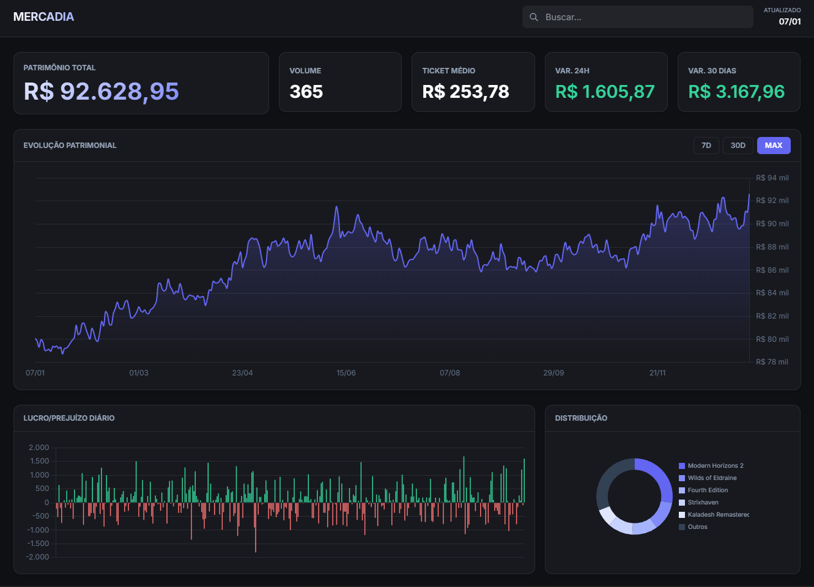
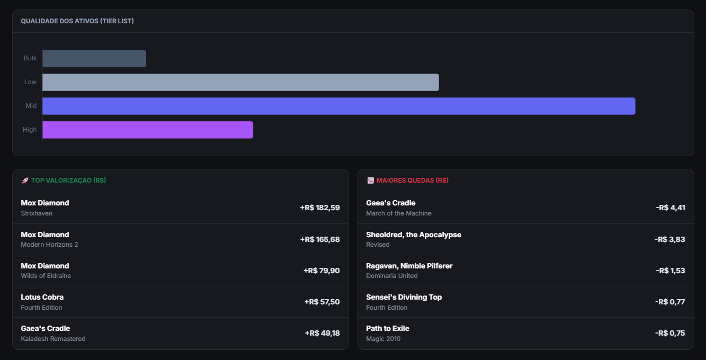
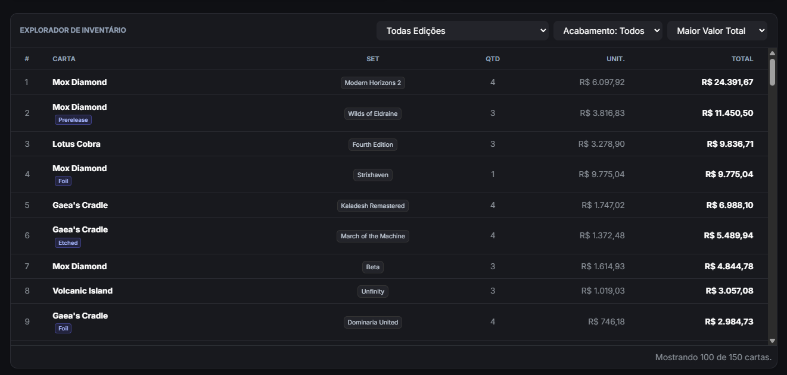

<!-- pandoc relatorio.md   -o Relatorio_Mercadia.pdf   --pdf-engine=pdflatex   --toc   --toc-depth=2   --number-sections   -V lang=pt-BR   -V papersize=a4   -V geometry:margin=3cm   -V fontsize=12pt   -V linestretch=1.5   -V colorlinks=true   -V linkcolor=blue   -V urlcolor=blue   --highlight-style=tango -->
# RELATÓRIO TÉCNICO: SISTEMA MERCADIA 
Rodrigo Augusto Correa Soares <br>João Ricardo de Souza Teixeira <br>
**Disciplina:** Sistemas de Apoio a Decisão <br>
**Data:** 07/01/2026

---

## 1. O Problema e Apoio à Tomada de Decisão

### 1.1. Contextualização do Problema

O mercado secundário de *Magic: The Gathering* (MTG) é altamente volátil, assemelhando-se a uma bolsa de valores de ativos físicos. Colecionadores e investidores enfrentam dificuldades em rastrear o valor real de seus portfólios, dependendo frequentemente de planilhas manuais estáticas que não refletem a flutuação diária de preços, a liquidez dos ativos (facilidade de venda) ou a exposição ao risco de reimpressões (reprints).

### 1.2. Apoio à Tomada de Decisão

O sistema **Mercadia** resolve esse problema consolidando dados históricos e atuais para gerar um *dashboard* analítico em tempo real. Ele apoia a tomada de decisão organizacional/pessoal das seguintes formas:

1. **Gestão de Liquidez:** Através da classificação de ativos por "Tiers" (Bulk vs. High End), o gestor decide quais itens devem ser liquidados rapidamente para gerar caixa e quais devem ser mantidos para valorização a longo prazo.
2. **Identificação de Tendências:** Os gráficos de evolução patrimonial e variação de 30 dias permitem identificar se a coleção está em tendência de alta ou baixa, apoiando a decisão de "Stop Loss" (vender antes que desvalorize mais).
3. **Análise de Risco:** O gráfico de distribuição por edição permite visualizar a concentração do portfólio. Se uma única edição representa 80% do valor, o risco é alto; o sistema visualiza isso para que o gestor possa diversificar os ativos.

---

## 2. Justificativa do Projeto

Este sistema foi desenvolvido como um **Projeto Prático** focado na aplicação dos conceitos prévios e aprendidos na disciplina em um problema real do dia a dia.

A escolha se justifica pela complexidade dos dados envolvidos (milhares de itens com preços flutuantes) e pela necessidade real de ferramentas um mercado que movimenta bilhões de dólares anualmente, mas que ainda carece de software com arquitetura robusta e princípios de design modernos.

---

## 3. Lista de Requisitos do Sistema

### 3.1. Requisitos Funcionais

* **RF01 - Dashboard Analítico:** O sistema deve apresentar indicadores chave (KPIs) de Patrimônio Total, Volume, Ticket Médio e Variações (24h e 30d).
* **RF02 - Visualização Gráfica:** O sistema deve exibir no mínimo 4 gráficos distintos: Evolução Patrimonial (Linha), Lucro/Prejuízo Diário (Barras), Qualidade dos Ativos (Barras Horizontais) e Distribuição por Edição (Rosca).
* **RF03 - Interatividade:** O usuário deve ser capaz de filtrar o período de visualização (7 dias, 30 dias, Max) e interagir com os gráficos para filtrar tabelas de dados.
* **RF04 - Explorador de Inventário:** Deve haver uma tabela completa com funcionalidades de ordenação (Preço, Quantidade) e filtros (Edição, Acabamento).
* **RF05 - Busca com Histórico:** O sistema deve permitir buscar uma carta específica e visualizar seu histórico de preço detalhado.

### 3.2. Requisitos Não-Funcionais

* **RNF01 - Arquitetura MVC:** O sistema deve seguir estritamente o padrão Model-View-Controller.
* **RNF02 - Persistência em Arquivo:** Os dados devem ser lidos de uma base de dados em formato CSV.
* **RNF03 - Orientação a Objetos:** O backend deve ser construído utilizando Classes e Injeção de Dependência.

---

## 4. Arquitetura do Sistema

O sistema foi desenvolvido utilizando **Node.js** para o Backend e **HTML5/Bootstrap/Chart.js** para o Frontend, seguindo o padrão arquitetural **MVC (Model-View-Controller)**.

### Diagrama de Componentes (Conceitual)

* **Model:** Representado pela classe `Card`, define a estrutura de dados.
* **View:** Arquivos HTML/JS no front-end que renderizam os dados JSON recebidos.
* **Controller:** `DashboardController` gerencia as requisições HTTP e orquestra a resposta.
* **Service:** `AnalyticsService` contém toda a regra de negócio, cálculos matemáticos e formatação de dados para os gráficos.
* **Repository:** `CsvRepository` abstrai o acesso aos dados, sendo o único responsável por ler o arquivo físico.

---

## 5. Imagens Explicativas do Sistema



**Figura 1: Visão Geral do Dashboard**
*Descrição: A tela inicial apresenta a saúde financeira do portfólio e a evolução temporal do patrimônio.*

**Figura 2: Análise de Qualidade e Flutuações**
*Descrição: Acima, a segmentação dos ativos por faixa de preço. Abaixo, as maiores movimentações do período.*

**Figura 3: Explorador de Inventário e Filtros**
*Descrição: Ferramenta que permite ao gestor filtrar itens por acabamento (Foil/Normal) e ordenar por liquidez ou valor total.*

---

## 6. Aplicação dos Princípios SOLID

O sistema foi refatorado para garantir manutenibilidade e escalabilidade, aplicando os seguintes princípios:

### 1. SRP - Single Responsibility Principle (Princípio da Responsabilidade Única)

Separamos a leitura de dados da regra de negócio.

* **Código:** A classe `CsvRepository` cuida **apenas** do acesso ao arquivo. Se mudarmos de CSV para SQL, só mexemos aqui.

```javascript
// src/repositories/CsvRepository.js
class CsvRepository {
    constructor(filePath) {
    this.filePath = filePath
  }

  async getAll() {
    const results = []
    if (!fs.existsSync(this.filePath)) return []

    return new Promise((resolve, reject) => {
      fs.createReadStream(this.filePath)
        .pipe(csv())
        .on('data', (row) => {
          const total = parseFloat(row.Preco_Total)
          const qty = parseInt(row.Qtd)

          if (!isNaN(total)) {
            results.push(new Card(
              row.Data,
              row.Nome,
              row.Edicao,
              row.Num,
              row.Extras || '',
              qty,
              parseFloat(row.Preco_Unit),
              total
            ))
          }
        })
        .on('end', () => resolve(results))
        .on('error', (err) => reject(err))
    })
  }
}

```

### 2. OCP - Open/Closed Principle (Princípio Aberto/Fechado)

As entidades devem estar abertas para extensão, mas fechadas para modificação.

* **Código:** A classe `AnalyticsService` processa os dados. Adicionamos o novo gráfico de "Distribuição por Edição" estendendo o método de processamento sem precisar alterar como os dados são buscados ou como o objeto `Card` funciona.

```javascript
// src/services/AnalyticsService.js
todayData.forEach(c => {
    if(!setDistribution[c.set]) setDistribution[c.set] = 0;
    setDistribution[c.set] += c.totalPrice;
});

```

### 3. DIP - Dependency Inversion Principle (Princípio da Inversão de Dependência)

Módulos de alto nível não devem depender de módulos de baixo nível. Ambos devem depender de abstrações (no JS, usamos Injeção de Dependência).

* **Código:** O `DashboardController` não cria uma instância do repositório dentro dele ("new CsvRepository"). Ele recebe o serviço pronto. O `server.js` atua como o container de injeção de dependência.

```javascript
// server.js (Composition Root)
const repository = new CsvRepository(csvFile); // Baixo nível
const service = new AnalyticsService(repository); // Injeção
const controller = new DashboardController(service); // Alto nível recebe dependência

// O Controller não sabe que os dados vêm de um CSV, apenas que o Service entrega dados.
```
